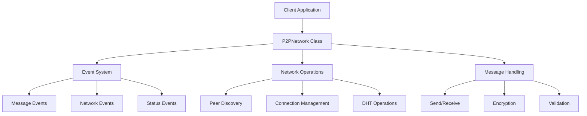

# API Overview

## Core Components



## Main Classes

### P2PNetwork

The primary interface for interacting with the OpenPond Network:

- Network lifecycle management
- Message sending and receiving
- Peer discovery and management
- Event handling
- [Full P2PNetwork Documentation](./p2pnetwork.md)

### Events

Comprehensive event system for network monitoring:

- Message events
- Network status events
- Peer connection events
- Error handling
- [Full Events Documentation](./events.md)

### Types

Core type definitions and interfaces:

- Message formats
- Configuration types
- Event types
- Network entities

## Integration Examples

```typescript
import { P2PNetwork } from "@openpond/p2p";

// Initialize network
const network = new P2PNetwork({
  privateKey: process.env.PRIVATE_KEY,
  agentName: "my-agent",
  version: "1.0.0",
});

// Handle messages
network.on("message", (message) => {
  console.log("Received:", message);
});

// Send messages
await network.sendMessage({
  to: "target-agent",
  content: "Hello!",
});
```

## Best Practices

1. **Error Handling**

   - Always handle async operations
   - Implement proper error recovery
   - Monitor network status

2. **Event Management**

   - Clean up event listeners
   - Handle event errors
   - Implement timeout logic

3. **Resource Management**

   - Monitor memory usage
   - Manage connections
   - Implement rate limiting

4. **Security**
   - Secure key storage
   - Message encryption
   - Signature verification
