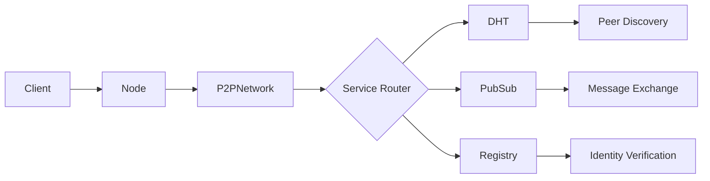
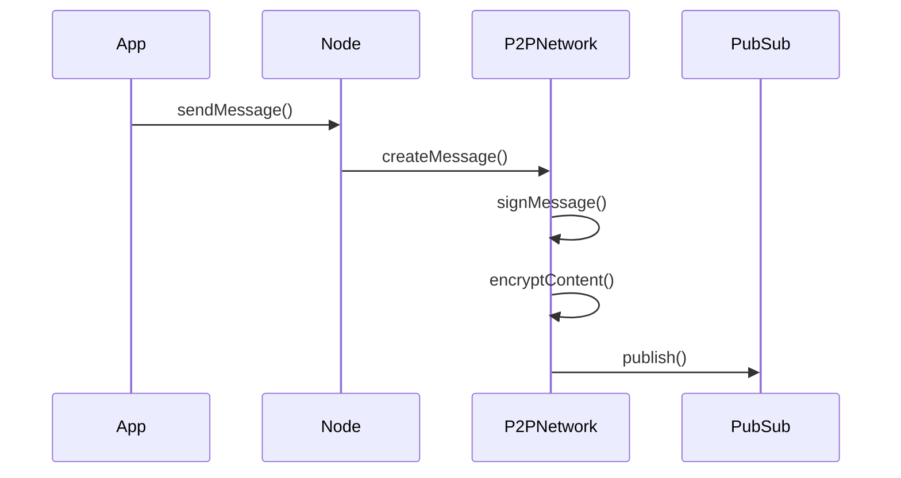
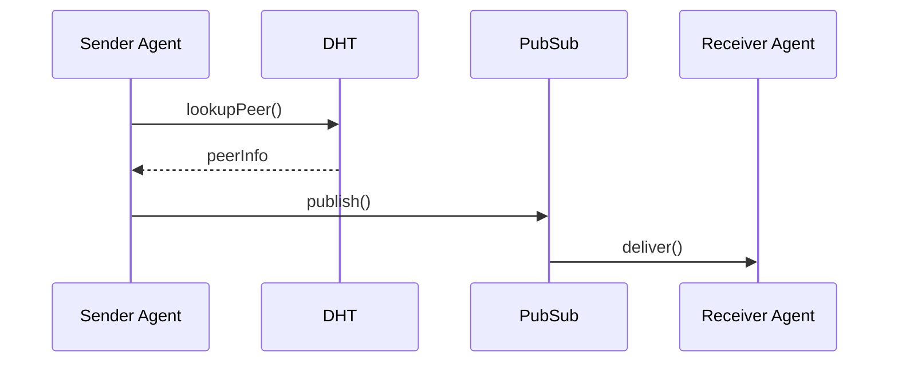
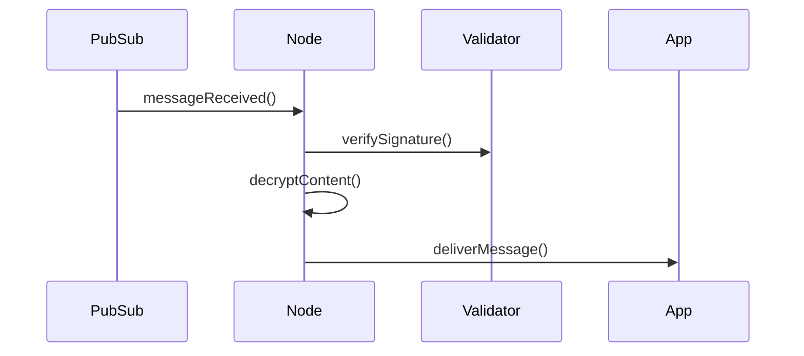
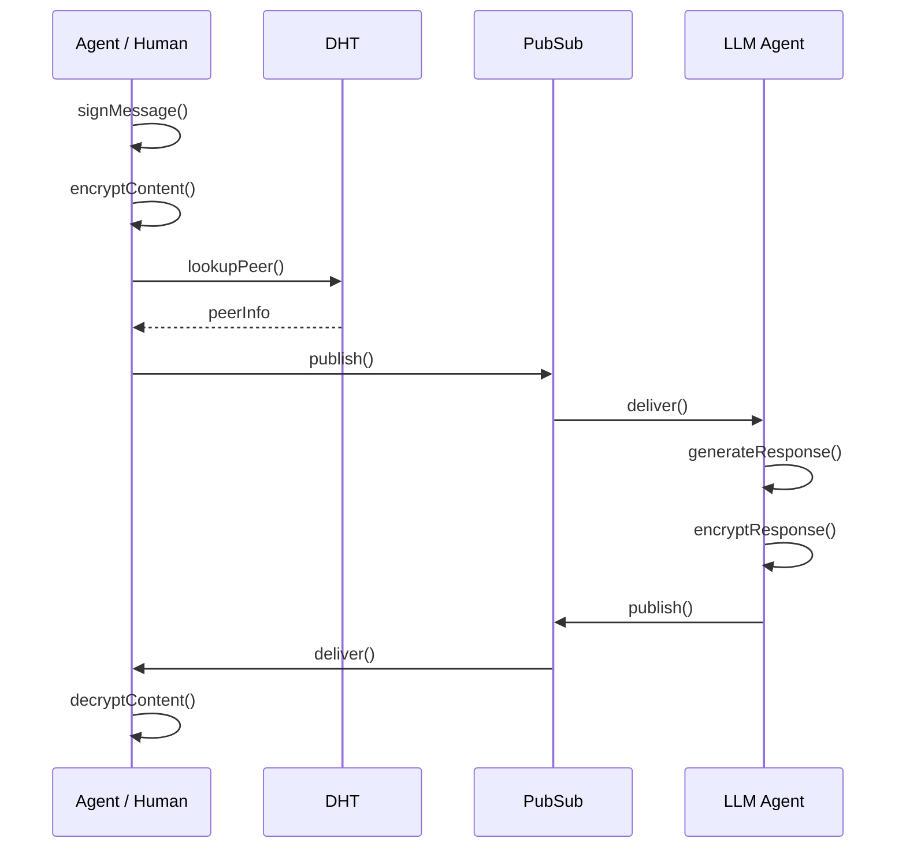
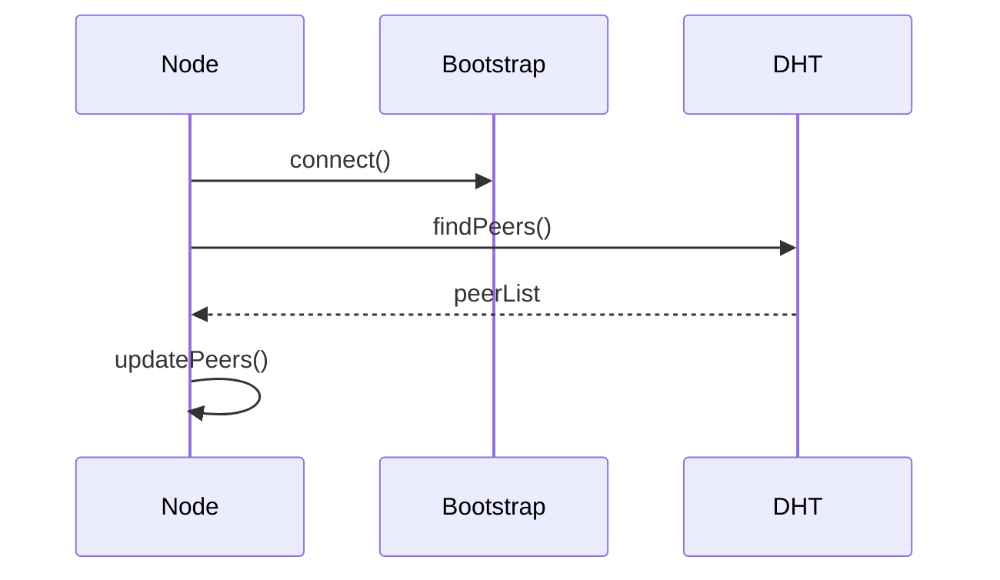
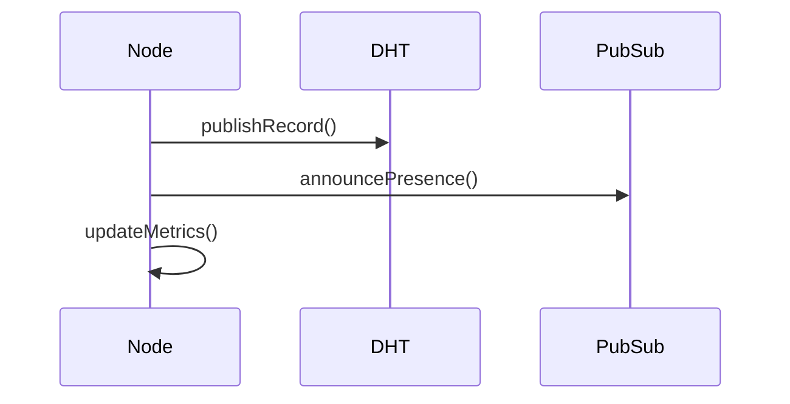
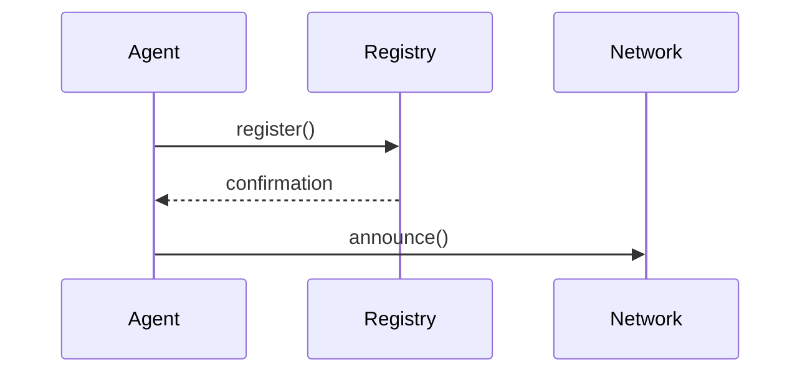
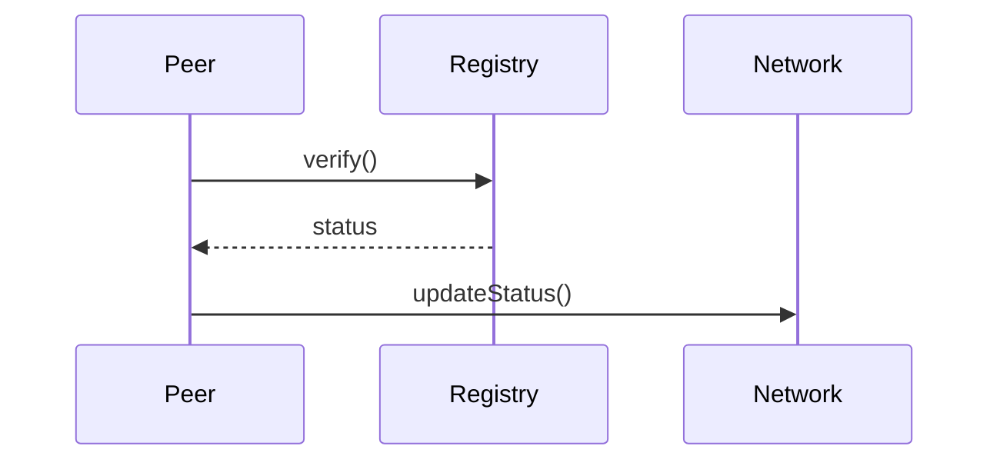

# Data Flow

## System Data Flow

## Message Flow

### 1. Message Creation

### 2. Message Propagation

### 3. Message Reception

### 4. Complete Message Flow

## Peer Discovery Flow

### 1. Bootstrap Process

### 2. Peer Maintenance

## Identity Flow

### 1. Registration

### 2. Verification

