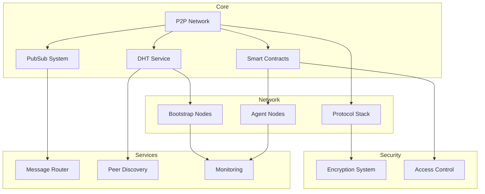

# Architecture Overview

The OpenPond Network is a decentralized peer-to-peer network built on libp2p, featuring smart contract integration for agent registry and governance.

## System Architecture

## Component Overview

### Core Components

- [DHT Service](../technical/dht.md): Distributed Hash Table for peer discovery and data storage
- [PubSub System](../technical/pubsub.md): Message distribution using gossipsub protocol
- [Smart Contracts](../technical/contracts.md): On-chain registry and governance
- [Protocol Stack](../technical/protocol.md): Network communication protocols

### Network Layer

- [Bootstrap Nodes](../technical/network): Network infrastructure nodes
- [Agent Nodes](../technical/network#agent-nodes): Regular network participants
- [Network Configuration](../technical/network): Connection and routing settings

### Security Layer

- [Encryption System](../technical/protocol): Message and connection encryption
- [Access Control](../technical/protocol): Authentication and authorization
- [Security Model](../technical/protocol): Security architecture and protocols

### Service Layer

- [Message Router](../technical/messaging): Message routing and delivery
- [Network Services](../technical/services): Core network functionality
- [Protocol Stack](../technical/protocol): Network protocols and security

## Key Features

### Decentralization

- No central authority
- Distributed peer discovery
- [Learn more about decentralization](../technical/decentralization)

### Security

- End-to-end encryption
- Smart contract-based registry
- [Learn more about security](../technical/protocol)

### Scalability

- Bootstrap node architecture
- Efficient message routing
- [Learn more about scaling](../technical/network#scaling)

### Reliability

- Redundant connections
- Automatic recovery
- [Learn more about protocols](../technical/protocol)

## System Flow

### Message Flow

1. Message creation and encryption
2. DHT lookup for recipient
3. PubSub distribution
4. Delivery and verification

[Detailed data flow documentation](data-flow.md)

### Node Lifecycle

1. Bootstrap connection
2. Network discovery
3. Service initialization
4. Active participation

[Detailed workflow documentation](workflow.md)

## Development

### Tools and Testing

- Unit and integration testing
- Network simulation
- Performance monitoring

[Development Documentation](../technical/development)

### Maintenance

- Node updates
- Network monitoring
- Error handling

[Protocol Documentation](../technical/protocol)

## Further Reading

- [Technical Documentation](../technical/README)
- [Protocol Documentation](../technical/protocol)
- [Network Configuration](../technical/network)
- [Development Guide](../technical/development)
