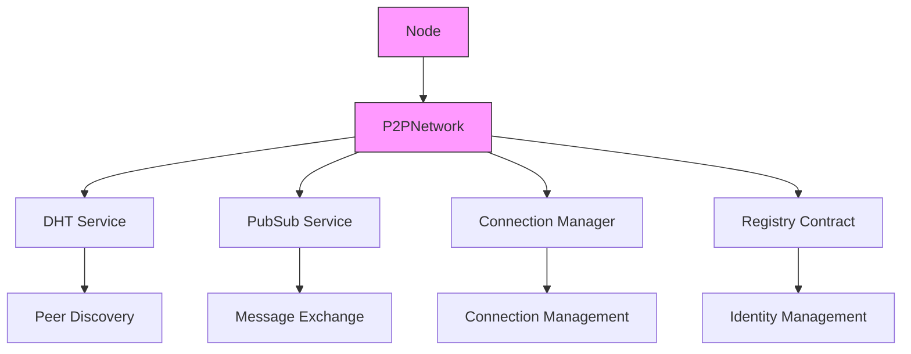

# Development Guide

## Architecture Decisions

### 1. DHT-First Approach

- Use DHT for all peer discovery
- Don't maintain complete local peer mappings
- Let the network handle routing naturally
- Reduces state management complexity

### 2. Bootstrap Node Strategy

- Run in DHT server mode
- Maintain larger routing tables
- Connect to each other for resilience
- Geographically distributed for better coverage

### 3. Regular Node Design

- Run in DHT client mode
- Connect to bootstrap nodes first
- Discover peers through DHT queries
- Minimize resource usage

## Implementation Details

### Core Components

### Key Files and Responsibilities

1. **p2p.ts**

   - Core network implementation
   - Service coordination
   - Message handling
   - Connection management

2. **agent-explorer.ts**

   - Network visualization
   - Real-time monitoring
   - User interface
   - Debug tools

3. **constants.ts**

   - Network configuration
   - Bootstrap node settings
   - Protocol constants
   - Default values

4. **logger.ts**
   - Logging infrastructure
   - Debug information
   - Metrics collection
   - Error tracking

## Development Guidelines

### Code Organization

1. **Service Layer**

   - DHT service
   - PubSub service
   - Connection manager
   - Registry interface

2. **Message Layer**

   - Message formatting
   - Signature handling
   - Encryption/Decryption
   - Topic management

3. **Network Layer**
   - Peer discovery
   - Connection handling
   - Protocol implementation
   - State management

### Best Practices

1. **Error Handling**

   - Use typed errors
   - Proper error propagation
   - Graceful degradation
   - Comprehensive logging

2. **Testing**

   - Unit tests for core logic
   - Integration tests for network
   - Simulation tests for scaling
   - Performance benchmarks

3. **Security**

   - Regular security audits
   - Signature verification
   - Proper key management
   - Rate limiting

4. **Performance**
   - Connection pooling
   - Message batching
   - Resource monitoring
   - Cache management

## Contribution Guidelines

### Pull Request Process

1. Fork the repository
2. Create feature branch
3. Implement changes
4. Add tests
5. Update documentation
6. Submit PR

### Code Style

- Use TypeScript
- Follow ESLint rules
- Document public APIs
- Write clear commit messages

### Testing Requirements

- Add unit tests
- Update integration tests
- Test with different node types
- Verify performance impact
