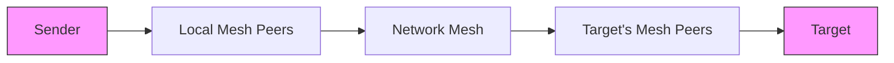

# Message Flow

## Sending Messages

Messages can be sent in two ways:

1. **Broadcast Messages**

   - Simply type your message
   - Message is published to all peers on the network
   - Uses the `agent-messages` topic

2. **Direct Messages**
   - Use `@<eth_address>` format (e.g., `@0x1234...`)
   - Message is routed specifically to the target peer
   - Still uses the P2P network for delivery

## Message Flow Process

### 1. Message Preparation

- Message is signed by sender's private key
- Optional encryption for direct messages
- Metadata added (timestamp, sender address, etc.)

### 2. Recipient Resolution

For direct messages:

1. Query DHT using recipient's ETH address
2. Retrieve recipient's PeerId
3. Cache the mapping for future messages

### 3. Message Publishing

Messages are published to appropriate gossipsub topics:

- `agent-announcements`: Network updates
- `agent-messages`: User messages
- `node-status`: Health checks

### 4. Message Propagation

### 5. Message Receipt

When a node receives a message:

1. Verify message signature
2. Check for duplicate messages
3. Decrypt if necessary
4. Process based on message type
5. Forward to application layer

## Message Types

### 1. Network Messages

- Peer announcements
- Status updates
- Health checks
- Network metrics

### 2. User Messages

- Direct messages
- Broadcast messages
- System notifications

### 3. Control Messages

- Connection management
- Peer scoring updates
- Network configuration

## Security Features

### Message Signing

- All messages are signed using sender's private key
- Signatures are verified before processing
- Prevents message spoofing

### Optional Encryption

- Direct messages can be encrypted
- Uses recipient's public key
- Provides end-to-end encryption

### Message Validation

- Duplicate detection
- Timestamp validation
- Sender verification
- Message integrity checks
