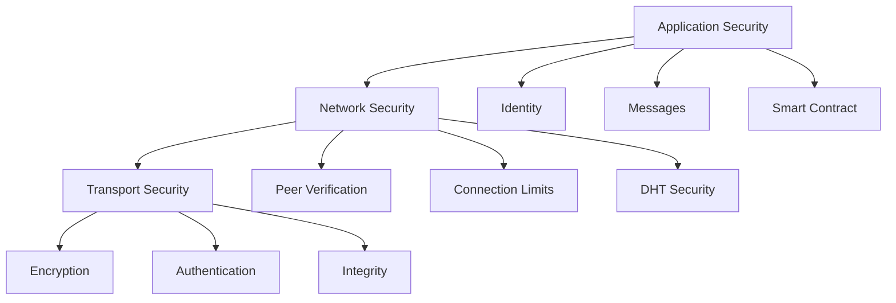

# Security Architecture

## Security Layers



## Identity Security

### Ethereum-based Identity

- Smart contract registration
- Public key infrastructure
- Address-based identification
- Reputation tracking

### Message Signing

- Ethereum key pair signing
- Signature verification
- Nonce management
- Replay protection

### Encryption

- Optional end-to-end encryption
- ECIES encryption scheme
- Key management
- Forward secrecy

## Network Security

### Bootstrap Node Security

- Node verification
- Connection authentication
- Load balancing
- DDoS protection

### Peer Verification

- Identity validation
- Contract status checking
- Reputation scoring
- Connection limiting

### DHT Security

- Record signing
- TTL enforcement
- Validation rules
- Anti-spam measures

## Message Security

### Content Security

- Message integrity
- Signature verification
- Content encryption
- Metadata protection

### Transport Security

- Noise protocol
- TLS-like security
- Perfect forward secrecy
- Man-in-the-middle protection

### Anti-spam

- Rate limiting
- Proof of work
- Reputation-based filtering
- Message size limits

## Smart Contract Security

### Registration

- Identity verification
- Stake requirements
- Cool-down periods
- Anti-Sybil measures

### Reputation

- Score calculation
- Penalty system
- Recovery mechanisms
- Appeal process

### Governance

- Access control
- Upgrade mechanisms
- Emergency procedures
- Community voting

## Security Considerations

### Current Measures

- ✅ Ethereum-based identity
- ✅ Message signing
- ✅ Transport encryption
- ✅ Peer verification
- ✅ Rate limiting

### Planned Improvements

- 🚧 Enhanced DDoS protection
- 🚧 Improved spam prevention
- 🚧 Advanced encryption options
- 🚧 Stake-based security
- 🚧 Automated threat detection

```

```
