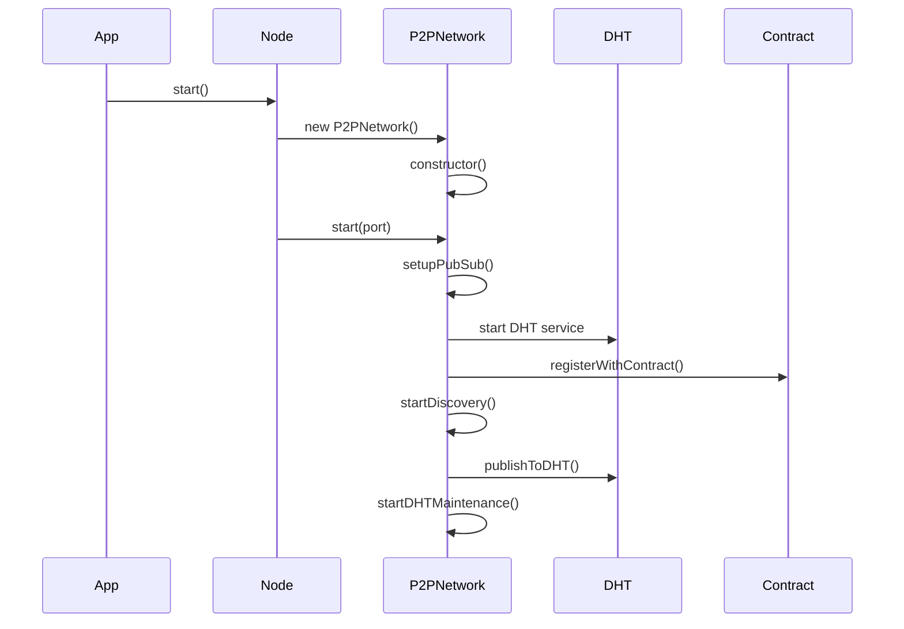
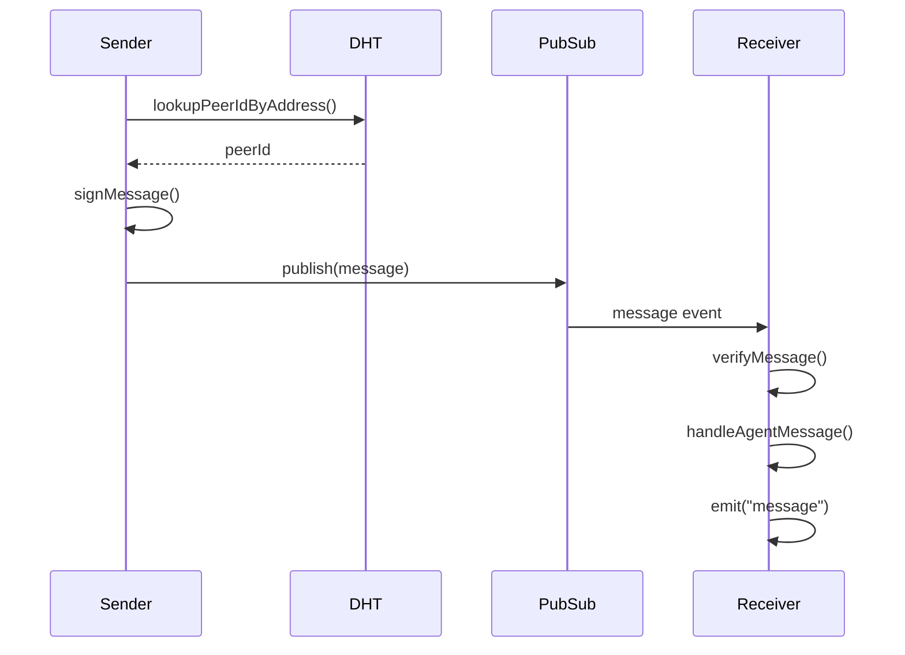
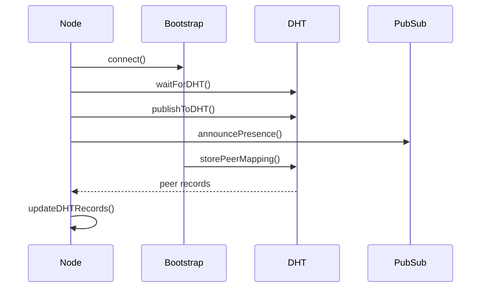
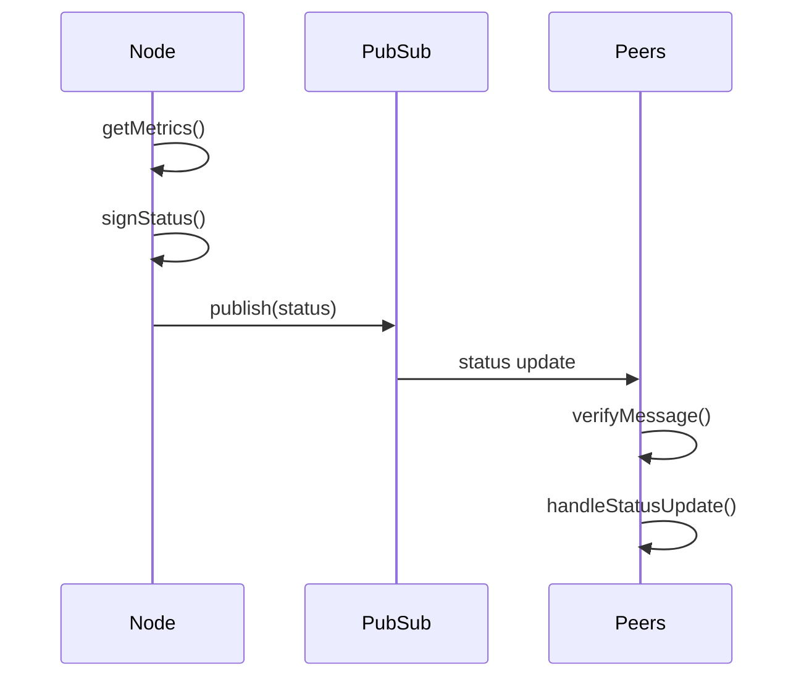

# Workflow Documentation

This document details the step-by-step workflows for various operations in the P2P network.

## Node Initialization Flow

## Message Exchange Flow

## Peer Discovery Flow

## Status Broadcasting Flow

## Method Call Sequence

### Node Startup

1. `start()` - Entry point
2. `initNode()` - Initialize node configuration
3. `P2PNetwork.constructor()` - Create network instance
4. `P2PNetwork.start()` - Start network services
5. `setupPubSub()` - Initialize messaging
6. `registerWithContract()` - Register with blockchain
7. `startDiscovery()` - Begin peer discovery
8. `startDHTMaintenance()` - Start maintenance tasks

### Message Handling

1. `sendMessage()` - Send a message
2. `lookupPeerIdByAddress()` - Find recipient
3. `signMessage()` - Sign the message
4. `handleAgentMessage()` - Process incoming message
5. `verifyMessage()` - Verify signature
6. `emit("message")` - Notify application

### Network Maintenance

1. `broadcastStatus()` - Share node status
2. `updateDHTRecords()` - Update peer records
3. `announcePresence()` - Broadcast availability
4. `handleStatusUpdate()` - Process peer updates
5. `storePeerMapping()` - Update peer mappings
