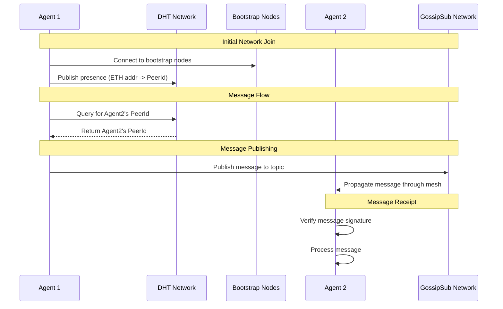

# Network Architecture

## DHT (Distributed Hash Table)

The network uses Kademlia DHT for peer discovery and routing:

- Each node publishes its presence to the DHT using its ETH address as the key
- Bootstrap nodes run in DHT server mode (clientMode=false)
- Regular nodes run in DHT client mode (clientMode=true)
- Peer lookups are done through DHT queries without maintaining local state
- Records naturally propagate through the network

## Messaging Layer (Gossipsub)

The network uses gossipsub for real-time message propagation:

### Topics

- `agent-announcements`: Node presence and network updates
- `agent-messages`: Direct and broadcast messages between agents
- `node-status`: Health checks and metrics

### Properties

- Messages propagate efficiently through the mesh
- No need to maintain direct connections to all peers
- Built-in message deduplication
- Heartbeat-based peer scoring

## System Flow

This diagram illustrates:

1. Initial network join where an agent connects to bootstrap nodes and publishes its presence
2. DHT lookup process when an agent needs to find another peer
3. Message publishing through GossipSub
4. Message propagation and verification

The system uses DHT for peer discovery (mapping ETH addresses to PeerIds) and GossipSub for efficient message propagation. This hybrid approach gives us both reliable peer discovery and efficient real-time messaging.
