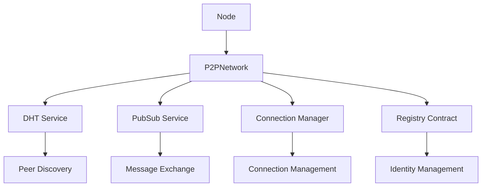
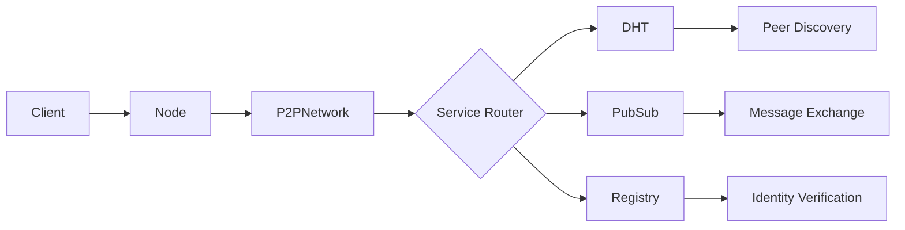

# System Overview

## Architecture Components

## Core Components

### 1. Node (`node.ts`)

- Entry point for the P2P network
- Handles configuration and environment setup
- Manages node lifecycle (startup/shutdown)
- Coordinates between different components

### 2. P2PNetwork (`p2p.ts`)

- Core networking functionality
- Implements peer discovery and message exchange
- Manages DHT and PubSub services
- Handles encryption and message signing

## Data Flow

## Configuration

The system can be configured through environment variables:

- `NODE_TYPE`: "bootstrap" or "agent"
- `PRIVATE_KEY`: Ethereum private key
- `REGISTRY_ADDRESS`: Smart contract address
- `USE_ENCRYPTION`: Enable/disable message encryption
