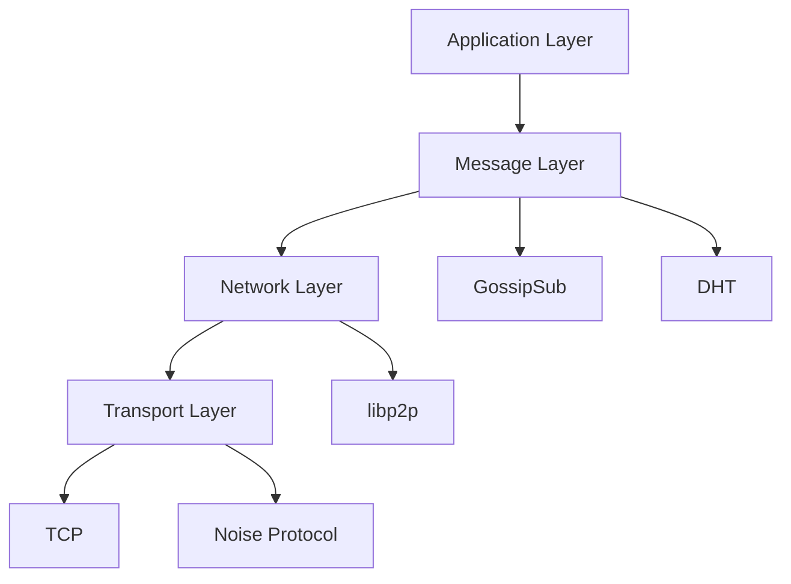

# Protocol Specification

## Protocol Stack

## Layer Components

### 1. Transport Layer

- TCP for reliable communication
- Noise Protocol for encryption
- Yamux for stream multiplexing

### 2. Network Layer

- libp2p for peer-to-peer networking
- PeerID-based addressing
- Multi-address support

### 3. Message Layer

- GossipSub for pub/sub messaging
- Kademlia DHT for peer discovery
- Smart contract integration for identity

### 4. Application Layer

- Agent registration and verification
- Message encryption (optional)
- Ethereum-based identity

## Protocol Rules & Enforcement

### 1. Identity Verification

- Smart contract-based registration
- Cryptographic proof of ownership
- Peer-based validation

### 2. Message Propagation

- Signed message verification
- Contract compliance checking
- Reputation-based routing

### 3. Network Participation

- Registration requirement
- Peer scoring system
- Stake-based incentives

## Security Model

### 1. Identity Security

- Ethereum-based identity
- Message signing
- Optional encryption

### 2. Network Security

- Bootstrap node verification
- Connection limits
- Peer verification

### 3. Message Security

- Signature verification
- Optional end-to-end encryption
- Nonce-based message uniqueness
